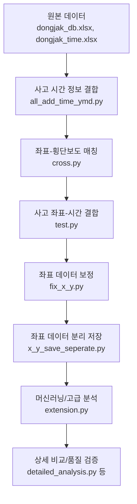

# 동작구 교통사고 데이터 분석 프로젝트

동작구 지역의 교통사고 데이터를 분석하고 처리하는 Python 기반 데이터 분석 프로젝트

## 📁 프로젝트 구조 및 주요 스크립트 역할 (정리)

| 스크립트                | 입력 파일                        | 출력 파일                        | 주요 역할 및 설명                                      |
|-------------------------|-----------------------------------|-----------------------------------|------------------------------------------------------|
| all_add_time_ymd.py     | dongjak_time.xlsx                 | a.xlsx (= accYmdandtime.xlsx)     | 사고 발생 시간(accYmd)부터 서울특별시까지 349개 데이터 추출 및 생성 |
| cross.py                | dongjak_db.xlsx                   | filtered_results.xlsx             | 사고 좌표와 횡단보도 좌표 컬럼명 통일, 오차범위 내 데이터 필터링   |
| test.py                 | dongjak_time.xlsx                 | filtered_result_with_dates.xlsx   | 컬럼명 변경 후 사고 좌표와 동작구 좌표 비교, 379개 데이터 필터링   |
| dj.py                   | dongjak_db_x_y.xlsx               | dj_xy.xlsx                        | 동작구 사고 데이터 필터링 (좌표 및 위치 정보 등)                  |
| fix_x_y.py              | dongjak_db_x_y.xlsx               | filtered_results.xlsx             | 좌표 데이터 보정 및 필터링 (600여 개)                            |
| x_y_save_seperate.py    | dongjak_db_y_x.xlsx               | dj_09_filtered_xy.xlsx, dj_09_non_filtered_xy.xlsx | 좌표 데이터 분리 저장                                 |
| extension.py            | accYmdandtime.xlsx                | -                                 | 머신러닝 결과 분석                                         |

### 주요 데이터 파일
- **dongjak_time.xlsx**: 사고 발생 시간 및 좌표 데이터
- **dongjak_db.xlsx / dongjak_db_x_y.xlsx / dongjak_db_y_x.xlsx**: 동작구 사고 데이터(좌표, 위치 등)
- **accYmdandtime.xlsx**: 사고 발생 시간 및 기타 정보
- **filtered_results.xlsx, filtered_result_with_dates.xlsx, dj_xy.xlsx, dj_09_filtered_xy.xlsx, dj_09_non_filtered_xy.xlsx, a.xlsx**: 각 단계별로 필터링/가공된 결과 데이터

---

## 🔍 분석 흐름 및 데이터 파이프라인

이 프로젝트의 데이터 분석 흐름은 다음과 같이 단계별로 진행됩니다.

### 1. 원본 데이터 준비
- **dongjak_db.xlsx / dongjak_db_x_y.xlsx / dongjak_db_y_x.xlsx**: 동작구 교통사고 원본 데이터(좌표, 위치, 사고 정보 등)
- **dongjak_time.xlsx**: 사고 발생 시간 및 좌표 정보

### 2. 데이터 전처리 및 필터링
- **사고 시간 정보 결합**: `all_add_time_ymd.py` — dongjak_time.xlsx → a.xlsx(=accYmdandtime.xlsx, 349개)
- **좌표 기반 사고-횡단보도 매칭**: `cross.py` — dongjak_db.xlsx → filtered_results.xlsx (좌표 오차범위 내 필터링)
- **사고 좌표와 시간 정보 결합**: `test.py` — dongjak_time.xlsx → filtered_result_with_dates.xlsx (379개)
- **좌표 데이터 보정 및 추가 필터링**: `fix_x_y.py` — dongjak_db_x_y.xlsx → filtered_results.xlsx (600여 개)
- **좌표 데이터 분리 저장**: `x_y_save_seperate.py` — dongjak_db_y_x.xlsx → dj_09_filtered_xy.xlsx, dj_09_non_filtered_xy.xlsx

### 3. 최종 데이터 및 분석
- 각 단계별로 필터링/가공된 결과 데이터(`filtered_results.xlsx`, `filtered_result_with_dates.xlsx`, `dj_xy.xlsx`, `dj_09_filtered_xy.xlsx`, `dj_09_non_filtered_xy.xlsx`, `a.xlsx` 등)이 생성됨

### 4. 머신러닝/고급 분석
- `extension.py` — accYmdandtime.xlsx → 머신러닝 결과 분석

### 5. 상세 비교/품질 검증
- `detailed_analysis.py`, `compare_files.py`, `final_comparison.py` — 여러 단계의 결과 파일을 비교, 품질 검증, 통계 분석

---

## 🗺️ 분석 흐름 시각화

---

> 💡 **참고:**
> - 데이터는 여러 단계의 전처리, 필터링, 결합, 보정 과정을 거쳐 최종 분석/머신러닝에 활용됩니다.
> - 각 단계별로 중간 결과 파일이 생성되며, 이 파일들은 다음 단계의 입력으로 사용됩니다.
> - 분석 흐름을 따라가면, 데이터가 어떻게 가공되고, 어떤 기준으로 필터링/결합되는지 한눈에 파악할 수 있습니다.

## 🎯 프로젝트 목적

이 프로젝트는 동작구 지역의 교통사고 데이터를 분석하여 다음과 같은 목표를 달성합니다:

1. **좌표 기반 데이터 필터링**: 정확한 좌표 매칭을 통한 데이터 정제
2. **시간 데이터 통합**: 사고 발생 시간 정보와 좌표 데이터 결합
3. **데이터 품질 검증**: 필터링된 데이터의 정확성 및 일관성 확인
4. **상세 분석**: 다양한 관점에서의 데이터 분석 및 시각화

## 🛠️ 주요 기능

### 1. 좌표 데이터 필터링 (`dj.py`)
- 동작구 사고 데이터의 좌표 정보 필터링
- 오차 범위 내 좌표 매칭 (0.0014 이내)
- 필터링된 결과를 Excel 파일로 저장

### 2. 시간 데이터 통합 (`add_time.py`)
- 사고 발생 시간 정보 추가
- 좌표 기반 시간 데이터 매칭
- 정확한 시간 정보와 좌표 결합

### 3. 상세 데이터 분석 (`detailed_analysis.py`)
- 파일 간 데이터 비교 분석
- 좌표 데이터 품질 검증
- 통계적 분석 및 분포 확인

### 4. 파일 비교 및 검증 (`compare_files.py`, `final_comparison.py`)
- 필터링 전후 데이터 비교
- 데이터 일관성 검증
- 결과 파일 검증

## 📊 데이터 파일 설명

### 입력 데이터
- `dongjak_db_x_y.xlsx`: 동작구 사고 데이터 (좌표 정보 포함)
- `dongjak_time.xlsx`: 시간 데이터 (사고 발생 시간 및 좌표)

### 출력 데이터
- `dj_xy.xlsx`: 필터링된 좌표 데이터
- `filtered_dongjak_time_data.xlsx`: 시간 정보가 추가된 데이터
- `dj_09_filtered_xy.xlsx`: 추가 필터링된 데이터
- `filtered_result_with_dates.xlsx`: 날짜 정보가 포함된 최종 결과

## 📈 분석 결과

### 데이터 필터링 결과
- **원본 데이터**: 동작구 전체 사고 데이터
- **필터링된 데이터**: 정확한 좌표 매칭을 통한 정제된 데이터
- **시간 통합 데이터**: 사고 발생 시간 정보가 추가된 완성된 데이터셋

### 품질 지표
- 좌표 정확도: 0.0014 이내 오차 범위
- 시간 데이터 매칭률: 높은 정확도로 시간 정보 통합
- 데이터 일관성: 필터링 전후 데이터 검증 완료

## 🔧 기술 스택

- **Python 3.x**: 주요 프로그래밍 언어
- **pandas**: 데이터 처리 및 분석
- **numpy**: 수치 계산
- **openpyxl**: Excel 파일 처리

## 📝 주의사항

1. **파일 경로**: 스크립트 내의 파일 경로를 실제 데이터 파일 위치에 맞게 수정해야 합니다.
2. **데이터 형식**: 입력 Excel 파일의 시트명과 컬럼명이 코드와 일치해야 합니다.
3. **메모리 사용량**: 대용량 데이터 처리 시 충분한 메모리가 필요할 수 있습니다.